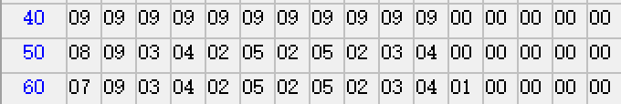
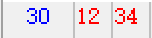
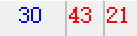
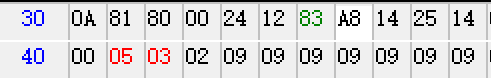

```assembly
ORG 0000H
SJMP START
ORG 0030H

START:
MOV R3, #10H
MOV R0, #40H
MOV R1, #50H
MOV R6, #60H
MOV R7,#00H
LOOP3:
     MOV A,@R0
     ADD A,R7
     ADD A,@R1
     DA A
     SWAP A
     MOV 71H,R1
     MOV R1,#30H
     MOV @R1,#00H
     XCHD A,@R1
     SWAP A
     MOV R1,71H
     
     MOV 70H,R0
     MOV 72H,A
     MOV A,R6
     MOV R0,A
     MOV @R0,72H
     MOV R0,70H
     MOV R7,30H
     INC R0
     INC R1
     INC R6
     DJNZ R3,LOOP3
SJMP $

END

```



```assembly
ORG 0000H
SJMP START
ORG 0030H

START:
MOV R0,#30H
MOV R1,#31H
XCH A, @R0
SWAP A
XCH A,@R1
SWAP A
XCH A,@R0

SJMP $

END
```



```c
ORG 0000H
SJMP START
ORG 0030H

START:
MOV R3,30H
MOV R0,#31H
MOV 41H,#00H
MOV 42H,#00H
MOV 43H,#00H

LOOP:
CJNE @R0,#00H,NOTZERO
INC 43H
SJMP NEXT

NOTZERO:
CJNE @R0,#80H,NEQUAL
INC 43H
SJMP NEXT

NEQUAL:
JC POSITIVE
INC 42H
SJMP NEXT

POSITIVE:
INC 41H

NEXT:
INC R0
DJNZ R3,LOOP

SJMP $

END

```

