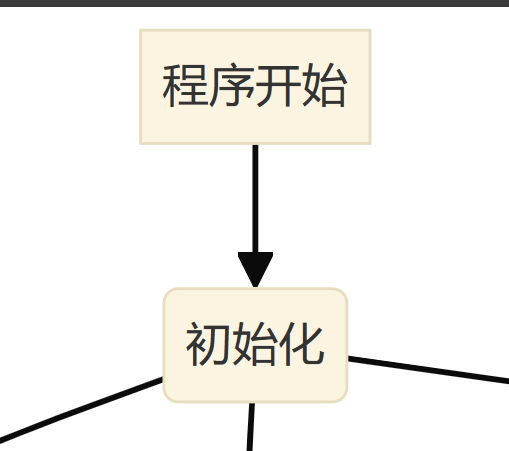
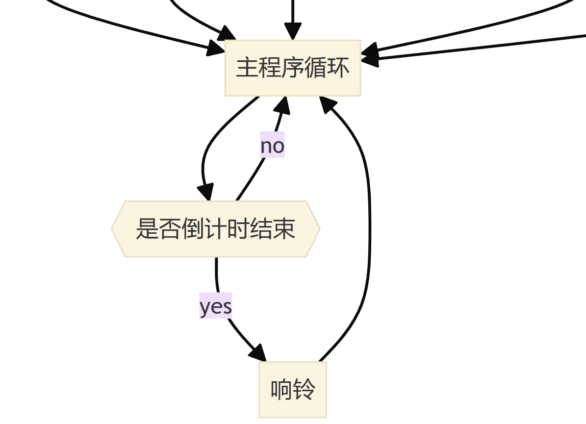
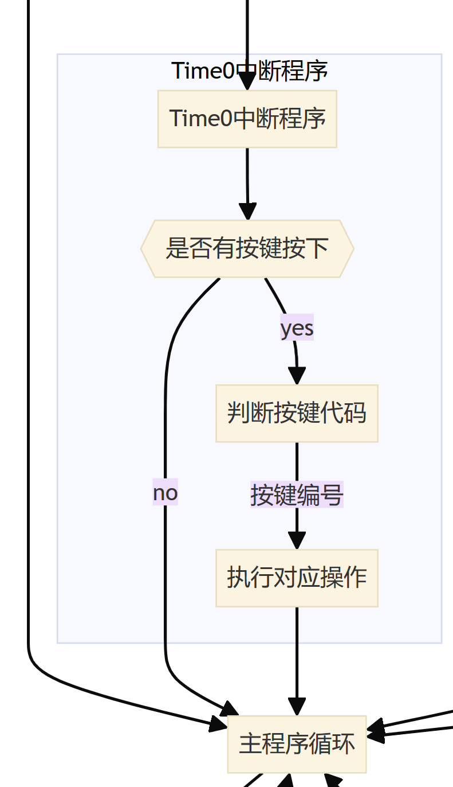
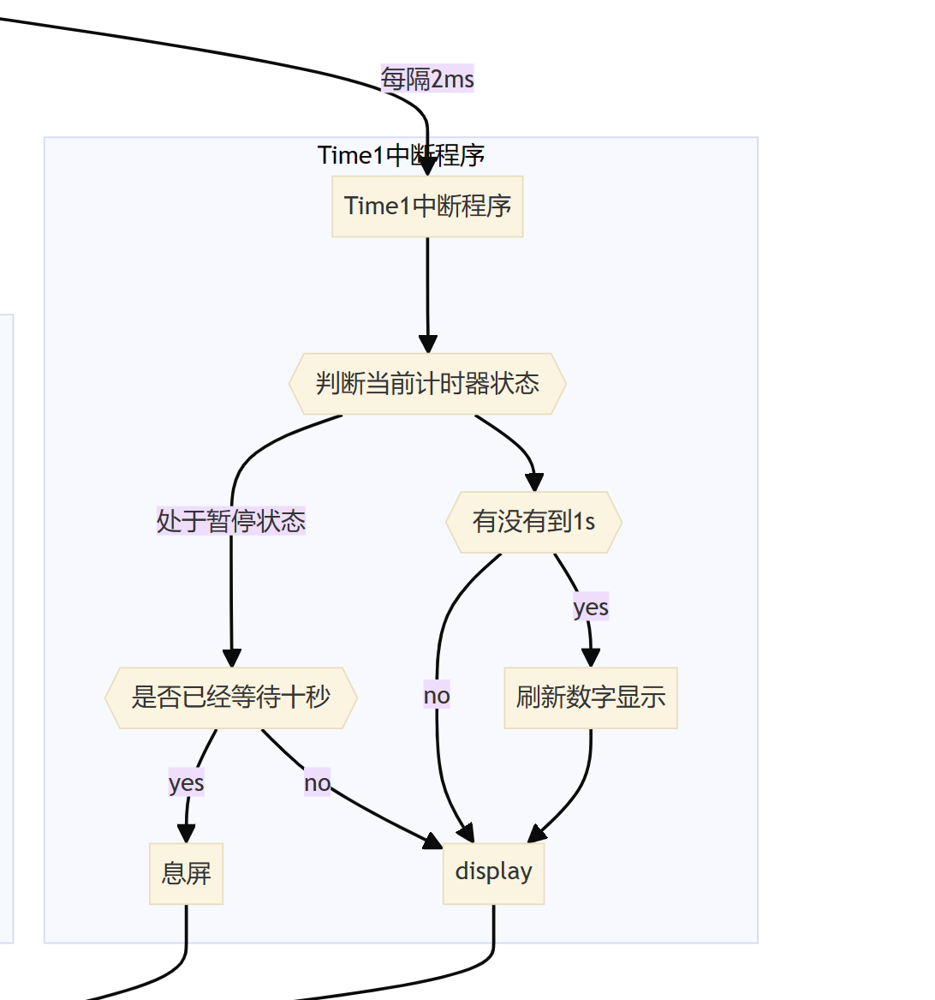

### 状态

共两种状态

#### 1. 计时

##### 正计时

##### 倒计时

#### 2. 暂停状态

### Operate逻辑

#### 08H，归零键

如果按归零键，归零，且暂停状态

#### 0BH, 开始/暂停

##### 在计时状态下

将状态设置为暂停

##### 在暂停状态下

开始计时

主要为了判断当前状态是否为响铃状态，如果是则调用响铃子程序；在执行这段代码的过程中会被定时器中断

不断打断。

